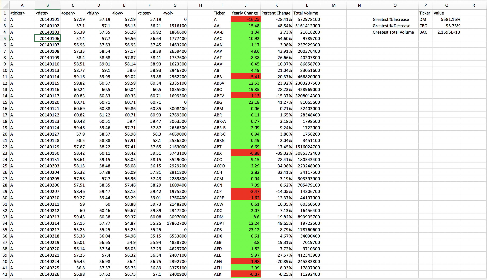
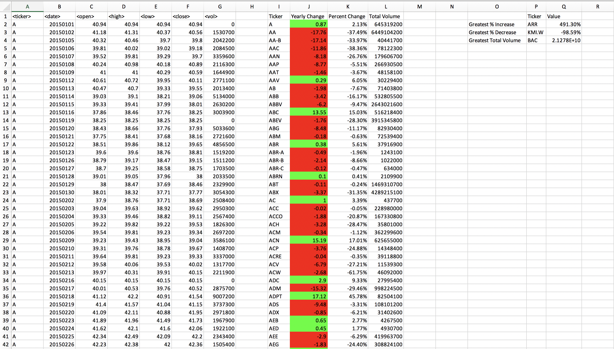
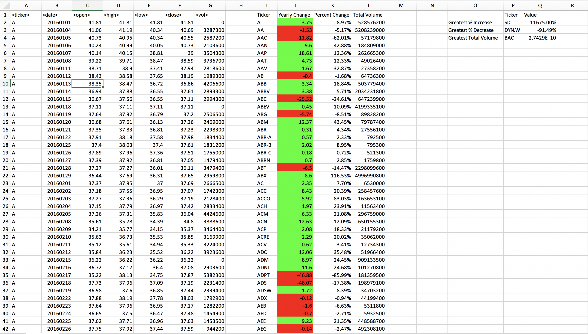

# Stockmarket Analysis Project

## A quick analysis of stock market data with Excel, powered by VBA.

In this project, we compute some very baseline metrics for the stock market and individual ticker symbols using data from 2014, 2015, and 2016.

It exercises the skills we aquired in the USC Data Analytic Bootcamp and heavily relies on Excel Macros (Visual Basic for Applications [VBA] scripts). We summarize, for each symbol, its absolute and relative change year-over-year, and its yearly total trading volume. We then compute, for each year, which ticker symbol saw the largest relative gain, the largest relative loss, and the highest trading volume.

Detailed instructions can be found here: [Instructions](instructions/README.md)

## Results

### Screenshots

Screenshots of the evaluated spreadsheets for each year are provided below:

**2014**

**2015**

**2016**

### VBA Code

The project was split into 'easy', 'moderate', and 'hard' parts. There was also a challenge to have the VBA code iterate over all years (Workbooks). I solved all three parts and incorporated the solution to the challenge in all of them.

* [EASY.vbs](EASY.vbs)
* [MODERATE.vbs](MODERATE.vbs)
* [HARD.vbs](HARD.vbs)
